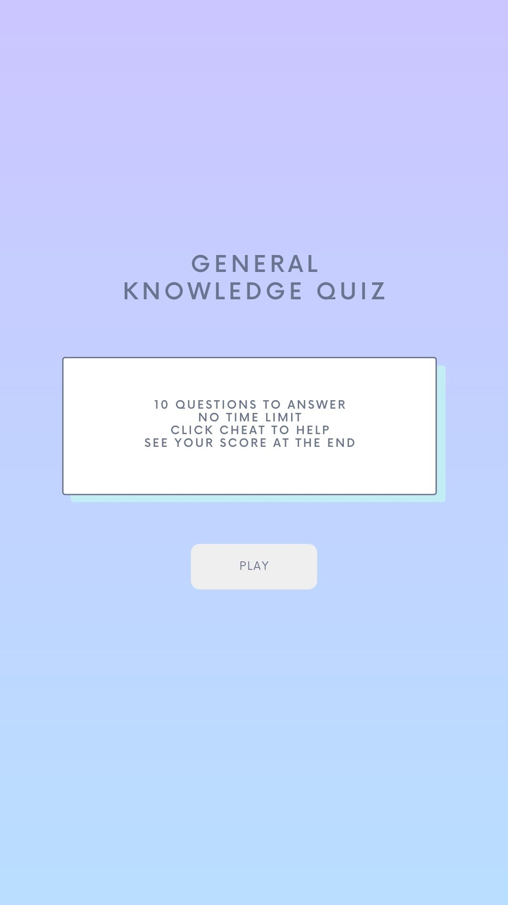
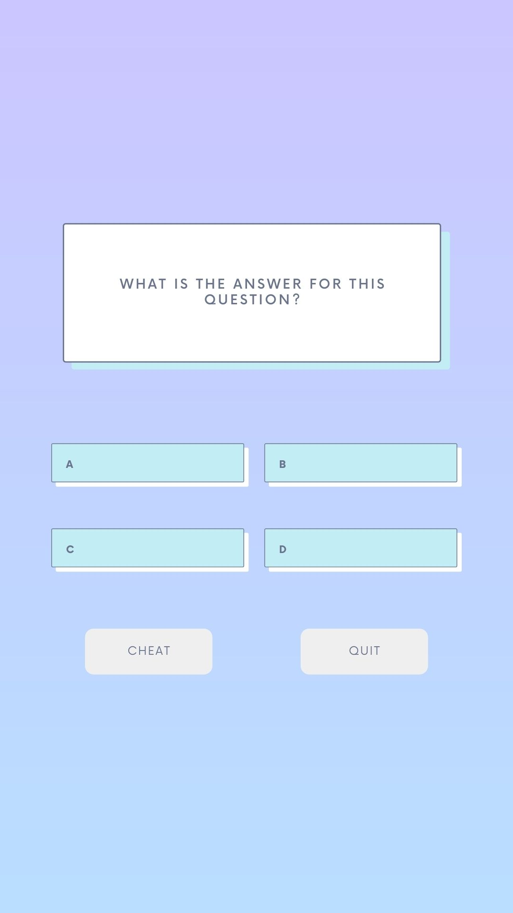
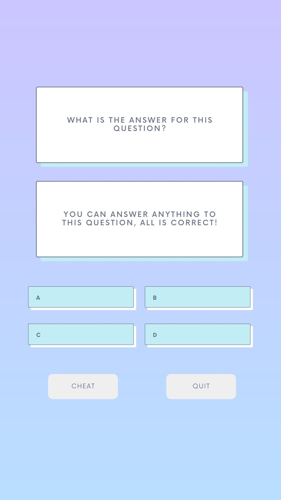
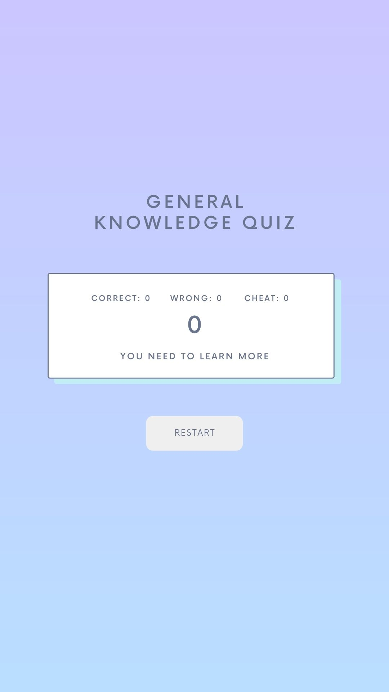

# Project Development Strategy

##  JavaScript Quiz: Focusing on State

### Wireframe

  
## Set-Up

__A User can see my initial repository and live demo__

### Repo 

> On this step the project repo was generated from template [w3-validation-template](https://github.com/HackYourFutureBelgium/state-project-js-quiz)

 Steps:

- Generate repo from template
- Turn on GitHub Pages
- Written initial, basic README
- Development-strategy file created
- Created issues per branches

## 1. User Story: User can see a quiz

Set up User Interface based on the wireframe so that user can see how the quiz is by clicking the start button

Steps:
- Create a new branch from master branch, named `user-interface`
- Develop `HTML` for two pages: front/end page and quiz page, link them through start button with href
- Add `CSS` accordingly 
- Open PR to the master branch
 

## 2. User Story: User can see many questions

The user can see many questions and many answers

Steps:
- Create a new branch from the master branch, named `see-questions`
- Add a **list of questions** (and answers) on, **variables** and **state** on `data.js`
- Add a **function** to randomly show the questions and render it to HTML on `view.js` ?
- Open PR from the branch to the master branch

## 3. User Story: User can choose the answer

A user can click on the answer and see the feedback from each answer whether it is true or false by color differentiation

Steps:
- Create a new branch from the master branch, named `choose-answer`
- Add a **function** for users to select the answer on `handler.js` including:
    - State and log updates
    - once clicked: it will give a different color and bring to the next question
    - if the last question: a warning if it is last question with a prompt and the _quit_ button changes to _see result_
- Add an **event listener** to _click answer_ on `listener.js`
- Open PR from the branch to the master branch

## 4. User Story: User can end the quiz without answering all questions

A user can quit before finishing the quiz

Steps:
- Create a new branch from the master branch, named `quit-quiz`
- Add a **function** to let players quit the game on `handler.js` including state and log updates, leading to **end result page**
- Add an **event listener** for the quit button on `listener.js`
- Open PR from the branch to the master branch

## 5. User Story: User can see the end result

A user can see how many questions are correcly answered, etc and also can see their answer on the end page

Steps:
- Create a new branch from the master branch, named `end-result`
- Add a function to **calculte the score** on `logic.js`
- Add a function to render **end result** score and details from state on `view.js`
- Open PR from the branch to the master branch

## 6. Additional User Story: User can cheat

A user can click on cheat button to see a clue to answer the question

Steps:
- Create a new branch from the master branch, named `see-cheat`
- Add a **function** to let players see the clue on `handler.js` including state and log updates
- Add a function to **render the clue** on `view.js`
- Open PR from the branch to the master branch
  

## Finishing Touches

- Validate codes to check for any last mistakes
- All bugs and errors were fixed
